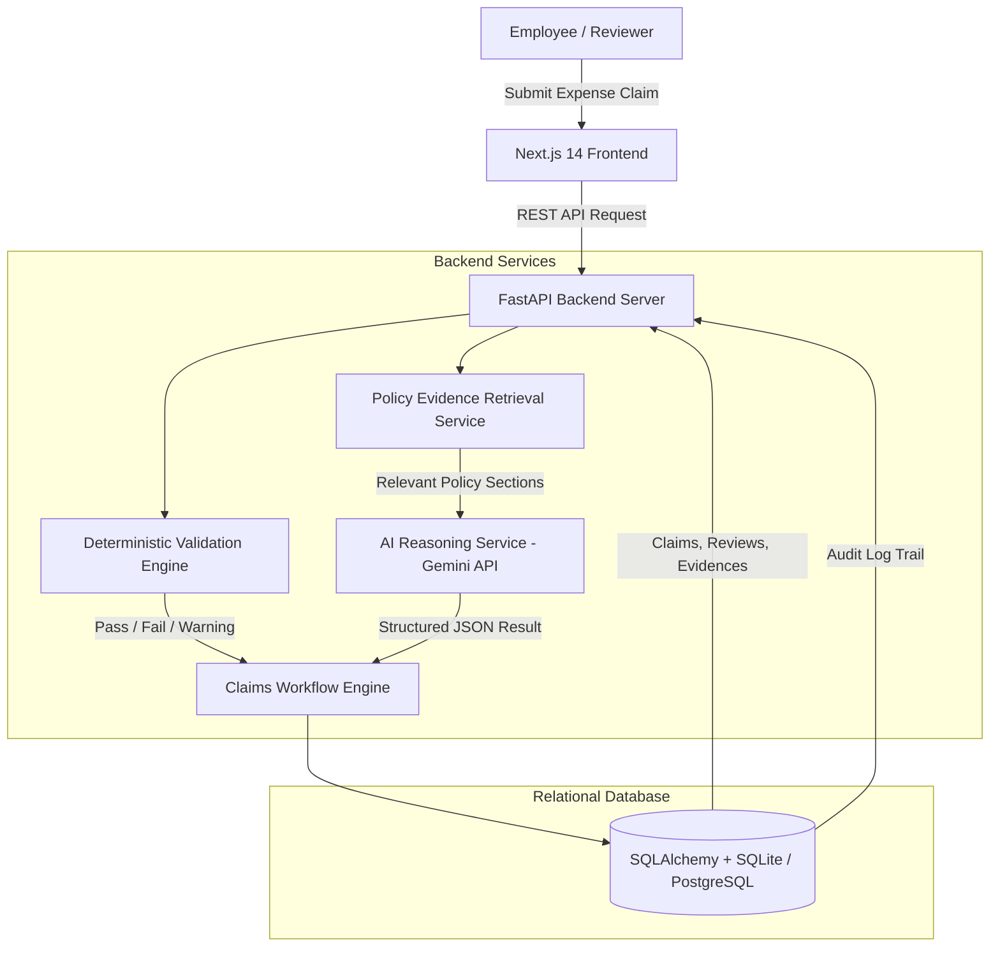

# PolicyGuard — Expense Claim Policy Review Assistant


**PolicyGuard** is an enterprise-grade, full-stack internal web application designed to review employee expense claims against an organization's supplied expense policy. It combines **deterministic rule validation** for hard numerical/policy boundaries, **AI-assisted classification and policy evidence reasoning** via Google Gemini, **policy evidence citations**, **human reviewer overrides**, and a **complete audit trail**.

> **MANDATORY RESPONSIBLE AI DISCLAIMER**  
> *This application provides policy-based review assistance. It does not provide legal, tax, or formal compliance certification.*

---

## 🏗️ Architecture Overview

PolicyGuard isolates deterministic business rule validation from AI classification, ensuring that LLMs are never used for simple numeric math or strict hard constraints.



---

## ✨ Completed Scope vs Excluded Scope

### ✅ Completed Scope
1. **Claim Intake & Validation**: Complete support for `claimant`, `date`, `category`, `amount`, `currency`, `description`, `receipt_available`.
2. **Deterministic Business Rules**: Mandatory fields, positive amount check (`amount > 0`), valid date & future date policy warning, exact duplicate claim detection, policy-based receipt requirement check, category spending limits.
3. **AI-Assisted Workflow**: Ambiguous description classification, uncertainty flagging (`UNCERTAIN` / `REQUIRES_CLARIFICATION`), missing information prompt extraction, policy evidence section retrieval & citations.
4. **Human Reviewer Actions**: Approve, Reject (with mandatory reason), Request Clarification (with mandatory message), Override AI classification (with mandatory new category & reason, preserving original AI prediction record).
5. **Audit Trail & History**: Complete sequential timeline view of all intake, validation, AI analysis, and reviewer actions.
6. **Policy Library**: Active policy management, versioning (v2.1), section search, and raw text/markdown policy importer.
7. **Frontend Dashboard**: Total metrics, pending reviews, approved, rejected, category spend breakdown, search, status filtering, and sorting.

### 🚫 Intentionally Excluded Scope
- Actual financial reimbursement / bank payment processing.
- Payroll system integrations.
- Formal tax/legal compliance advice.
- Receipt OCR image scanning.

---

## 🛠️ Tech Stack

- **Backend**: Python 3.10+, FastAPI, SQLAlchemy 2.0, Pydantic v2, Uvicorn, Pytest.
- **Frontend**: Next.js 14+ (App Router), React 18, TypeScript, Tailwind CSS, Lucide React icons.
- **Database**: Relational SQLite (local/demo), architected with SQLAlchemy ORM for seamless PostgreSQL migration.
- **AI Integration**: Google Gemini API (`gemini-2.5-flash`) with structured JSON schema validation and a rule-based fallback engine for graceful AI-service failure handling.

---

## ⚡ Quick Start & Setup Instructions

### 1. Clone & Environment Setup
```bash
git clone https://github.com/Ayankkk29/PolicyGuard.git
cd PolicyGuard

# Copy environment variables example
copy .env.example .env
```

### 2. Backend Setup & Run
```bash
# Navigate to project root
cd PolicyGuard

# Activate Python Virtual Environment
# Windows:
.\venv\Scripts\activate
# Linux/macOS:
source venv/bin/activate

# Install backend dependencies
pip install -r backend/requirements.txt

# Seed initial Policy v2.1 and sample claims
cd backend
python -m app.utils.seed

# Launch FastAPI Backend Server
uvicorn app.main:app --reload --port 8000
```
- **Backend API**: `http://localhost:8000`  
- **Swagger API Docs**: `http://localhost:8000/docs`

### 3. Frontend Setup & Run
Open a second terminal window:
```bash
cd PolicyGuard/frontend

# Install dependencies
npm install

# Run Next.js Development Server
npm run dev
```
- **Frontend Web Dashboard**: `http://localhost:3000`

---

## 🧪 Test Results

Backend automated tests:

```text
9 passed
```

The test suite covers:
- valid claims
- missing required fields
- negative amounts
- missing receipts
- duplicate claims
- category limit violations
- ambiguous descriptions
- reviewer decisions
- AI/fallback handling

---

## 🧪 Running Automated Tests

Run the complete Pytest backend test suite:

```bash
cd PolicyGuard/backend
..\venv\Scripts\pytest
```

---

## 🚀 Deployment Instructions

Recommended setup: Render for the FastAPI backend, Neon for PostgreSQL, and Vercel for the Next.js frontend.

### 1. Create the database
1. Create a PostgreSQL project in Neon.
2. Copy its connection string. Use the pooled connection string if offered, and ensure it starts with `postgresql://` (not `postgres://`).

### 2. Deploy the backend on Render
1. In Render, create a new Blueprint and select this GitHub repository. Render reads the root `render.yaml` and configures the API service.
2. Set the prompted environment values:
    - `DATABASE_URL`: Neon PostgreSQL connection string.
    - `AI_API_KEY`: Google Gemini API key. This can be left blank to use the fallback reviewer.
3. Deploy and verify the service at `https://your-api.onrender.com/`. The response should report `"status": "healthy"`; API docs are at `/docs`.
4. In the Render service Shell, run `python -m app.utils.seed` once to add the policy and demonstration claims.

### 3. Deploy the frontend on Vercel
1. Import the same GitHub repository into Vercel.
2. Set **Root Directory** to `frontend`.
3. Add `NEXT_PUBLIC_API_URL` with the full Render API origin, for example `https://your-api.onrender.com` (no trailing slash).
4. Deploy, then update the Render `FRONTEND_URL` value with the Vercel deployment URL if needed and redeploy the backend.

`NEXT_PUBLIC_API_URL` is used during the frontend build, so set it before deploying or redeploy after changing it. Do not use SQLite for hosted data because a local SQLite file may not persist across service restarts or redeploys. Keep API keys in the hosting provider's environment settings, never in Git.

The backend currently allows requests from any browser origin. `FRONTEND_URL` is not currently wired into the CORS middleware, so it is not a required deployment variable.

---

## 🎬 Recommended Assessment Reviewer Demo Flow

Test all required scenarios directly on `http://localhost:3000`:

### Scenario 1: Compliant Claim
1. Click **Submit New Claim**.
2. Enter Claimant: `Rahul Sharma`, Date: `2026-10-02`, Category: `Meals`, Amount: `1850`, Description: `"Dinner with client"`, Receipt: `Checked`.
3. **Outcome**: Deterministic checks PASS. AI predicts `Meals` with high confidence (>90%) citing Policy Section 3.2 (Limit ₹2,000). Status: `AI_REVIEWED`. Click **Approve**.

### Scenario 2: Limit Breach (Deterministic Failure)
1. Click **Submit New Claim**.
2. Enter Claimant: `Anita Roy`, Category: `Meals`, Amount: `3500`, Description: `"Executive lunch"`, Receipt: `Checked`.
3. **Outcome**: Category Limit check fails (₹3,500 > ₹2,000 limit). Status: `NEEDS_REVIEW`. Click **Reject** and provide reason.

### Scenario 3: Ambiguous Description (Uncertain AI)
1. Click **Submit New Claim**.
2. Enter Claimant: `Vikram Patel`, Category: `Meals`, Amount: `800`, Description: `"Meeting expense"`, Receipt: `Checked`.
3. **Outcome**: AI flags `UNCERTAIN CLASSIFICATION` with low confidence. Missing information box prompts for clarification. Status: `REQUIRES_CLARIFICATION`. Click **Request Clarification**.
